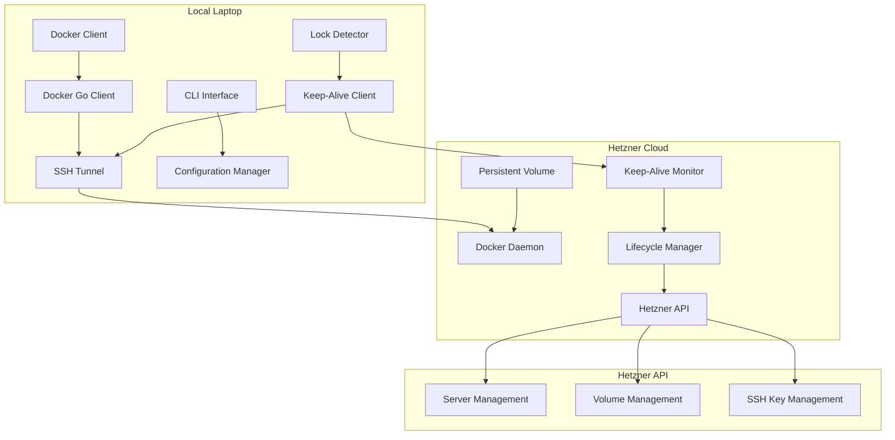
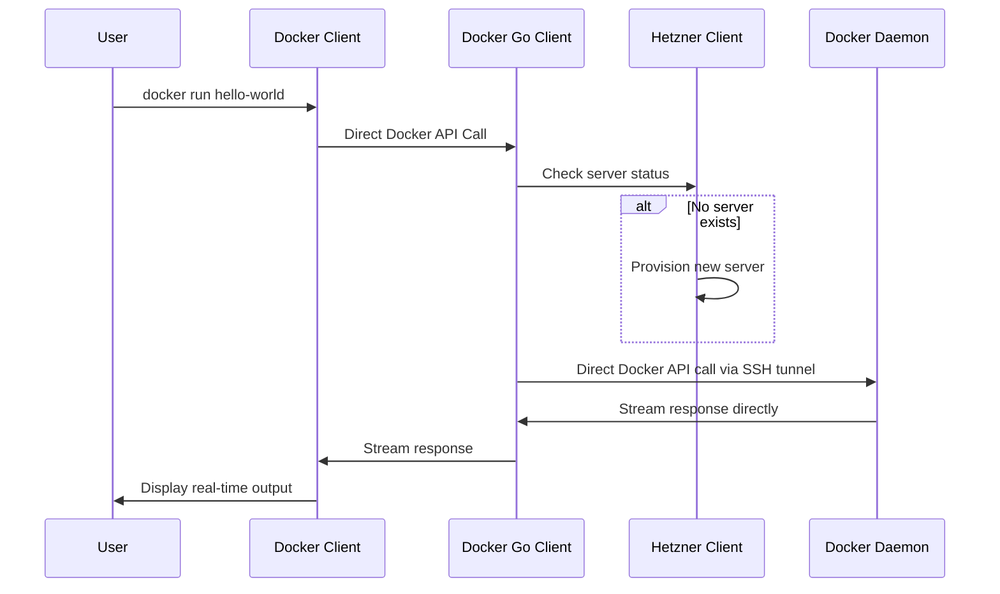

# Design Document

## Overview

DockBridge is a simplified client system built in Go that enables seamless Docker development workflows by directly connecting to remote Hetzner Cloud servers using the Docker Go client library. The system has been refactored from a complex HTTP proxy approach to eliminate overcomplicated connection management and fix streaming issues with commands like `docker run`.

The simplified architecture has one main component:
- **Client**: Runs locally, uses Docker Go client over SSH tunnel to communicate directly with remote Docker daemon, manages server lifecycle and keep-alive messaging

## Architecture

### Simplified System Architecture



### Simplified Component Interaction Flow



## Components and Interfaces

### Client Components

#### 1. Docker Client Manager (`internal/client/docker/`)
**Interface:**
```go
type DockerClientManager interface {
    GetClient(ctx context.Context) (*client.Client, error)
    EnsureConnection(ctx context.Context) error
    Close() error
}
```

**Responsibilities:**
- Creates Docker Go client instances connected to remote servers via SSH tunnel
- Manages simple SSH tunnel connections without complex pooling
- Handles Docker client lifecycle and connection management
- Provides direct access to Docker API without HTTP proxy layer

**Key Implementation Details:**
```go
// Simplified Docker client creation over SSH tunnel
func (dcm *DockerClientManager) GetClient(ctx context.Context) (*client.Client, error) {
    // Ensure SSH tunnel is established
    if err := dcm.ensureSSHTunnel(ctx); err != nil {
        return nil, err
    }
    
    // Create Docker client pointing to SSH tunnel
    dockerClient, err := client.NewClientWithOpts(
        client.WithHost(fmt.Sprintf("tcp://%s", dcm.tunnel.LocalAddr())),
        client.WithAPIVersionNegotiation(),
    )
    if err != nil {
        return nil, err
    }
    
    return dockerClient, nil
}
```

**Benefits of This Approach:**
- **Native Streaming**: Docker client handles streaming responses natively, fixing `docker run` freezing
- **Simplified Code**: Eliminates 3 complex files (proxy.go, connection_manager.go, request_handler.go)
- **Better Error Handling**: Docker client provides proper error context and retry mechanisms
- **Reduced Latency**: Direct API calls without HTTP proxy overhead
- **Easier Debugging**: Clear code path from CLI command to Docker daemon

#### 2. Hetzner Client (`internal/client/hetzner/`)
**Interface:**
```go
type HetznerClient interface {
    ProvisionServer(ctx context.Context, config *ServerConfig) (*Server, error)
    DestroyServer(ctx context.Context, serverID string) error
    CreateVolume(ctx context.Context, size int, location string) (*Volume, error)
    AttachVolume(ctx context.Context, serverID, volumeID string) error
    ManageSSHKeys(ctx context.Context) error
}
```

**Responsibilities:**
- Server provisioning with Docker CE pre-installed
- Volume creation and attachment management
- SSH key generation, upload, and rotation
- Cloud-init script deployment for server configuration
- Resource cleanup and cost optimization

#### 3. Lock Detector (`internal/client/lockdetection/`)
**Interface:**
```go
type LockDetector interface {
    Start(ctx context.Context) (<-chan LockEvent, error)
    Stop() error
}

type LockEvent struct {
    Type      LockEventType // Locked, Unlocked
    Timestamp time.Time
}
```

**Platform-specific implementations:**
- **Linux**: D-Bus monitoring for screensaver events
- **macOS**: Core Graphics session state monitoring  
- **Windows**: Win32 API desktop switching detection

#### 4. Keep-Alive Client (`internal/client/keepalive/`)
**Interface:**
```go
type KeepAliveClient interface {
    Start(ctx context.Context, serverEndpoint string) error
    Stop() error
    SendHeartbeat() error
}
```

**Responsibilities:**
- Sends periodic heartbeat messages (30-second intervals)
- Implements exponential backoff for network failures
- Handles connection recovery and retry logic
- Coordinates with lock detector for graceful shutdowns

### Simplified Server Components

The server-side complexity has been eliminated. The remote Hetzner servers now only need:

#### 1. Docker Daemon
- Standard Docker daemon running on the remote server
- Accessible via SSH tunnel on port 2376 or Unix socket
- No custom server-side code required

#### 2. Keep-Alive Monitor (Simple Script)
**Interface:**
```bash
#!/bin/bash
# Simple keep-alive monitor script deployed to server
```

**Responsibilities:**
- Simple bash script that monitors for client heartbeats
- Shuts down server if no heartbeat received within timeout
- Minimal implementation without complex state management

#### 3. Server Lifecycle (Cloud-init)
**Responsibilities:**
- Server provisioning and setup handled via cloud-init scripts
- Volume attachment managed through Hetzner API from client
- Self-destruction triggered by simple keep-alive timeout

## Data Models

### Configuration Models
```go
type ClientConfig struct {
    Hetzner    HetznerConfig    `yaml:"hetzner"`
    Docker     DockerConfig     `yaml:"docker"`
    KeepAlive  KeepAliveConfig  `yaml:"keepalive"`
    SSH        SSHConfig        `yaml:"ssh"`
    Logging    LoggingConfig    `yaml:"logging"`
}

type HetznerConfig struct {
    APIToken   string `yaml:"api_token" env:"HETZNER_API_TOKEN"`
    ServerType string `yaml:"server_type" default:"cpx21"`
    Location   string `yaml:"location" default:"fsn1"`
    VolumeSize int    `yaml:"volume_size" default:"10"`
}

type DockerConfig struct {
    SocketPath string `yaml:"socket_path" default:"/var/run/docker.sock"`
    ProxyPort  int    `yaml:"proxy_port" default:"2376"`
}
```

### Server State Models
```go
type Server struct {
    ID          string            `json:"id"`
    Name        string            `json:"name"`
    Status      ServerStatus      `json:"status"`
    IPAddress   string            `json:"ip_address"`
    VolumeID    string            `json:"volume_id"`
    CreatedAt   time.Time         `json:"created_at"`
    Metadata    map[string]string `json:"metadata"`
}

type ServerStatus string
const (
    StatusProvisioning ServerStatus = "provisioning"
    StatusRunning      ServerStatus = "running"
    StatusShuttingDown ServerStatus = "shutting_down"
    StatusTerminated   ServerStatus = "terminated"
)
```

### Keep-Alive Models
```go
type HeartbeatMessage struct {
    ClientID    string            `json:"client_id"`
    Timestamp   time.Time         `json:"timestamp"`
    Status      ClientStatus      `json:"status"`
    Metadata    map[string]string `json:"metadata"`
}

type ClientStatus string
const (
    StatusActive   ClientStatus = "active"
    StatusLocked   ClientStatus = "locked"
    StatusOffline  ClientStatus = "offline"
)
```

## Error Handling

### Error Categories
```go
type ErrorCategory string
const (
    ErrCategoryNetwork     ErrorCategory = "network"
    ErrCategoryHetzner     ErrorCategory = "hetzner"
    ErrCategoryDocker      ErrorCategory = "docker"
    ErrCategorySSH         ErrorCategory = "ssh"
    ErrCategoryConfig      ErrorCategory = "config"
    ErrCategoryLockDetect  ErrorCategory = "lock_detection"
)

type DockBridgeError struct {
    Category    ErrorCategory `json:"category"`
    Code        string        `json:"code"`
    Message     string        `json:"message"`
    Cause       error         `json:"cause,omitempty"`
    Retryable   bool          `json:"retryable"`
    Timestamp   time.Time     `json:"timestamp"`
}
```

### Retry Strategies
- **Network failures**: Exponential backoff with jitter (1s, 2s, 4s, 8s, max 60s)
- **Hetzner API rate limits**: Respect rate limit headers with backoff
- **Docker command failures**: Immediate retry up to 3 attempts
- **SSH connection failures**: Progressive timeout increase (5s, 15s, 30s)

### Graceful Degradation
- **Offline mode**: Cache last known server state, queue operations
- **Partial failures**: Continue operation with reduced functionality
- **Resource constraints**: Implement circuit breakers for external services

## Testing Strategy

### Unit Testing Framework
Using `github.com/stretchr/testify` with comprehensive test suites:

```go
type DockerProxyTestSuite struct {
    suite.Suite
    mockHetznerClient *mocks.HetznerClient
    mockSSHClient     *mocks.SSHClient
    proxy            *DockerProxy
    testServer       *httptest.Server
}

func (suite *DockerProxyTestSuite) TestForwardDockerCommand() {
    // Arrange
    expectedResponse := &http.Response{StatusCode: 200}
    suite.mockSSHClient.On("ForwardHTTP", mock.Anything).Return(expectedResponse, nil)
    
    // Act
    response, err := suite.proxy.ForwardRequest(testRequest)
    
    // Assert
    suite.NoError(err)
    suite.Equal(200, response.StatusCode)
    suite.mockSSHClient.AssertExpectations(suite.T())
}
```

### Integration Testing
- **Hetzner API Integration**: Test server provisioning with real API calls using test credentials
- **Docker Compatibility**: Validate all major Docker commands work correctly
- **End-to-End Workflows**: Test complete user scenarios from command to response

### Performance Testing
- **Latency Benchmarks**: Measure Docker command response times vs local execution
- **Concurrent Operations**: Test system behavior under multiple simultaneous Docker commands
- **Resource Usage**: Monitor memory and CPU usage during extended operations

### Security Testing
- **SSH Key Management**: Validate key generation, rotation, and secure storage
- **Network Security**: Test encrypted communication channels
- **API Token Handling**: Ensure secure storage and transmission of credentials

## Technology Stack

### Core Dependencies
- **Docker Integration**: `github.com/docker/docker/client` for direct Docker API access (primary change)
- **Hetzner Cloud**: `github.com/hetznercloud/hcloud-go/v2/hcloud` for cloud resource management
- **SSH Communication**: `golang.org/x/crypto/ssh` for simple tunnel creation (no complex wrappers)
- **CLI Framework**: `github.com/spf13/cobra` with `github.com/spf13/viper` for configuration
- **Lock Detection**: `github.com/IamFaizanKhalid/lock` with platform-specific implementations
- **Testing**: `github.com/stretchr/testify` for comprehensive test coverage

### Key Architectural Changes
- **Eliminated HTTP Proxy**: No more custom HTTP server intercepting Docker socket calls
- **Direct Docker Client**: Use Docker's official Go client library over SSH tunnel
- **Simplified Connection Management**: Single SSH tunnel per server, no connection pooling
- **Removed Server-Side Code**: No custom Go services on remote servers, just Docker daemon
- **Streaming Fix**: Docker client handles streaming natively, fixing `docker run` freezing issues

### Security Considerations
- **Credential Management**: Environment variables and secure file storage for API tokens
- **SSH Security**: RSA 4096-bit keys with regular rotation
- **Network Security**: TLS 1.3 for all HTTP communications
- **Access Control**: Principle of least privilege for Hetzner API permissions

### Performance Optimizations
- **Connection Pooling**: Reuse HTTP connections for Docker API calls
- **Concurrent Processing**: Goroutine-based handling of multiple Docker operations
- **Caching**: Local cache for server state and configuration
- **Compression**: Enable gzip compression for large Docker image transfers