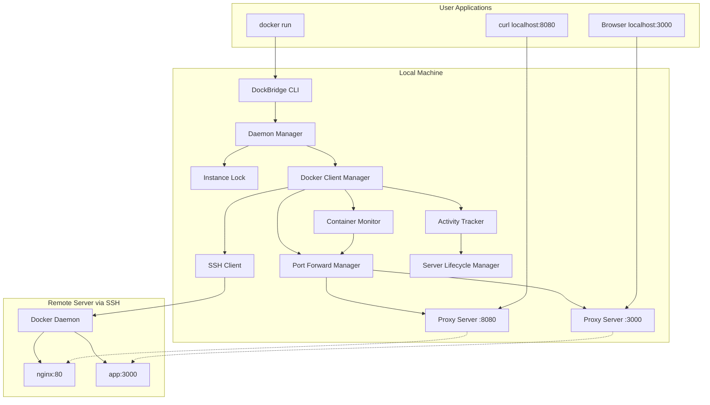
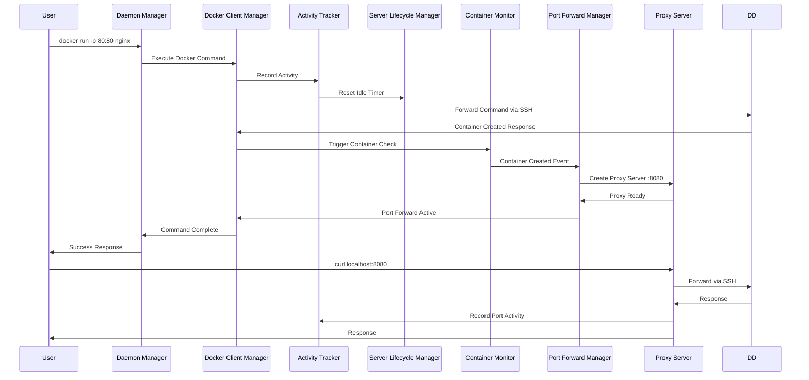

# Design Document

## Overview

The DockBridge Architecture Fix addresses critical issues in the current implementation by redesigning the server lifecycle management, implementing working port forwarding, fixing Docker client connections, and adding proper instance coordination. The design focuses on reliability, proper resource management, and clear separation of concerns.

## Architecture

### High-Level Architecture



### Component Integration Flow



## Components and Interfaces

### 1. Daemon Manager (`internal/client/daemon/`)

**Interface:**
```go
type DaemonManager interface {
    Start(ctx context.Context, config *DaemonConfig) error
    Stop() error
    IsRunning() bool
    
    // Instance management
    AcquireInstanceLock() error
    ReleaseInstanceLock() error
    CheckExistingInstance() (*InstanceInfo, error)
    
    // Docker command handling
    HandleDockerCommand(ctx context.Context, command []string) error
    
    // Status and health
    GetStatus() (*DaemonStatus, error)
    HealthCheck() error
}

type InstanceInfo struct {
    PID        int    `json:"pid"`
    SocketPath string `json:"socket_path"`
    StartTime  time.Time `json:"start_time"`
    IsRunning  bool   `json:"is_running"`
}

type DaemonStatus struct {
    Running           bool                    `json:"running"`
    ServerConnected   bool                    `json:"server_connected"`
    PortForwards      []*PortForwardStatus    `json:"port_forwards"`
    ActiveConnections int                     `json:"active_connections"`
    LastActivity      time.Time               `json:"last_activity"`
}
```

**Responsibilities:**
- Manages daemon lifecycle and instance locking
- Handles Docker socket creation and command routing
- Coordinates between all subsystems
- Provides health checking and status reporting
- Ensures only one instance per socket path

### 2. Enhanced Docker Client Manager (`internal/client/docker/`)

**Interface:**
```go
type DockerClientManager interface {
    Start(ctx context.Context) error
    Stop() error
    
    // Connection management
    EnsureConnection(ctx context.Context) error
    GetClient(ctx context.Context) (*client.Client, error)
    IsConnected() bool
    
    // Activity tracking integration
    SetActivityTracker(tracker ActivityTracker) error
    
    // Port forwarding integration
    StartPortForwarding(ctx context.Context) error
    StopPortForwarding() error
    GetPortForwardManager() PortForwardManager
    
    // Container monitoring
    GetContainerMonitor() ContainerMonitor
}

type ConnectionHealth struct {
    SSHConnected    bool      `json:"ssh_connected"`
    TunnelActive    bool      `json:"tunnel_active"`
    DockerReachable bool      `json:"docker_reachable"`
    LastCheck       time.Time `json:"last_check"`
    ErrorMessage    string    `json:"error_message,omitempty"`
}
```

**Responsibilities:**
- Manages SSH connections and Docker tunnels reliably
- Integrates with activity tracking for server lifecycle
- Coordinates container monitoring and port forwarding
- Provides connection health monitoring
- Handles reconnection logic with exponential backoff

### 3. Activity Tracker (`internal/client/activity/`)

**Interface:**
```go
type ActivityTracker interface {
    Start(ctx context.Context) error
    Stop() error
    
    // Activity recording
    RecordDockerActivity(operation string) error
    RecordPortActivity(localPort int, bytes int64) error
    RecordConnectionActivity(connectionType string) error
    
    // Activity queries
    GetLastActivity() time.Time
    IsActive() bool
    GetActiveConnections() int
    
    // Lifecycle integration
    SetServerLifecycleManager(manager ServerLifecycleManager) error
}

type ActivityRecord struct {
    Type      ActivityType `json:"type"`
    Timestamp time.Time    `json:"timestamp"`
    Details   interface{}  `json:"details"`
}

type ActivityType string
const (
    ActivityTypeDocker     ActivityType = "docker"
    ActivityTypePort       ActivityType = "port"
    ActivityTypeConnection ActivityType = "connection"
)
```

**Responsibilities:**
- Tracks all types of activity (Docker commands, port forwarding, connections)
- Provides activity status for server lifecycle decisions
- Integrates with server lifecycle manager
- Maintains activity history for debugging
- Supports configurable activity timeouts

### 4. Server Lifecycle Manager (`internal/client/lifecycle/`)

**Interface:**
```go
type ServerLifecycleManager interface {
    Start(ctx context.Context) error
    Stop() error
    
    // Server management
    EnsureServer(ctx context.Context) (*hetzner.Server, error)
    DestroyServerIfIdle(ctx context.Context) error
    ForceDestroyServer(ctx context.Context) error
    
    // Activity integration
    OnActivity(activityType ActivityType) error
    CheckIdleTimeout() (bool, time.Duration, error)
    
    // Status
    GetServerStatus() (*ServerStatus, error)
    IsServerActive() bool
}

type ServerStatus struct {
    Server          *hetzner.Server `json:"server,omitempty"`
    Status          string          `json:"status"`
    LastActivity    time.Time       `json:"last_activity"`
    IdleTimeRemaining time.Duration `json:"idle_time_remaining"`
    ActiveConnections int           `json:"active_connections"`
    RunningContainers int           `json:"running_containers"`
}
```

**Responsibilities:**
- Manages server provisioning and destruction based on activity
- Integrates with activity tracker for lifecycle decisions
- Ensures servers stay alive during active usage
- Handles graceful server shutdown with proper cleanup
- Provides server status and idle time information

### 5. Fixed Port Forward Manager (`internal/client/portforward/`)

**Enhanced Interface:**
```go
type PortForwardManager interface {
    Start(ctx context.Context) error
    Stop() error
    
    // Container lifecycle events (fixed interface)
    OnContainerCreated(container *monitor.ContainerInfo) error
    OnContainerStopped(containerID string) error
    OnContainerRemoved(containerID string) error
    
    // Port management with actual proxy servers
    CreatePortForward(containerID string, remotePort int) (*PortForward, error)
    RemovePortForward(forwardID string) error
    
    // Status and information
    ListPortForwards() ([]*PortForward, error)
    GetPortForward(forwardID string) (*PortForward, error)
    
    // Activity integration
    SetActivityTracker(tracker ActivityTracker) error
    
    // SSH client integration
    SetSSHClient(client ssh.Client) error
}

type PortForward struct {
    ID               string              `json:"id"`
    ContainerID      string              `json:"container_id"`
    ContainerName    string              `json:"container_name"`
    LocalPort        int                 `json:"local_port"`
    RemotePort       int                 `json:"remote_port"`
    Status           ForwardStatus       `json:"status"`
    ProxyServer      LocalProxyServer    `json:"-"` // Actual proxy server instance
    CreatedAt        time.Time           `json:"created_at"`
    LastUsed         time.Time           `json:"last_used"`
    BytesTransferred int64               `json:"bytes_transferred"`
}
```

**Responsibilities:**
- Creates and manages actual TCP proxy servers (not just metadata)
- Integrates with SSH client for tunnel creation
- Reports port forwarding activity to activity tracker
- Handles port conflict resolution with clear logging
- Provides real-time statistics and status

### 6. Enhanced Local Proxy Server (`internal/client/proxy/`)

**Enhanced Interface:**
```go
type LocalProxyServer interface {
    Start(ctx context.Context, localPort int, remoteAddr string) error
    Stop() error
    GetStats() *ProxyStats
    IsRunning() bool
    
    // Activity reporting
    SetActivityTracker(tracker ActivityTracker) error
    
    // Connection management
    GetActiveConnections() int
    GetConnectionHistory() []*ConnectionRecord
}

type ConnectionRecord struct {
    StartTime    time.Time     `json:"start_time"`
    EndTime      *time.Time    `json:"end_time,omitempty"`
    BytesSent    int64         `json:"bytes_sent"`
    BytesReceived int64        `json:"bytes_received"`
    RemoteAddr   string        `json:"remote_addr"`
    Error        string        `json:"error,omitempty"`
}
```

**Responsibilities:**
- Creates actual TCP listeners and proxy connections
- Reports connection activity to activity tracker
- Maintains detailed connection statistics
- Handles connection failures with retry logic
- Provides connection history for debugging

### 7. Fixed Container Monitor (`internal/client/monitor/`)

**Fixed Interface:**
```go
type ContainerMonitor interface {
    Start(ctx context.Context) error
    Stop() error
    
    // Event registration (fixed interface)
    RegisterContainerEventHandler(handler ContainerEventHandler) error
    
    // Container queries
    ListRunningContainers(ctx context.Context) ([]*ContainerInfo, error)
    GetContainer(ctx context.Context, containerID string) (*ContainerInfo, error)
    
    // Docker client integration
    SetDockerClient(client *client.Client) error
    
    // Activity integration
    SetActivityTracker(tracker ActivityTracker) error
}

// Fixed interface to match port forward manager
type ContainerEventHandler interface {
    OnContainerCreated(container *ContainerInfo) error
    OnContainerStopped(containerID string) error
    OnContainerRemoved(containerID string) error
}
```

**Responsibilities:**
- Monitors Docker daemon for container lifecycle events
- Uses correct interface signatures for event handlers
- Integrates with activity tracker for container activity
- Handles Docker client reconnection gracefully
- Provides reliable container state synchronization

## Data Models

### Configuration Models

```go
// Enhanced daemon configuration
type DaemonConfig struct {
    SocketPath        string                `yaml:"socket_path"`
    HetznerClient     hetzner.HetznerClient `yaml:"-"`
    SSHConfig         *SSHConfig            `yaml:"ssh"`
    HetznerConfig     *HetznerConfig        `yaml:"hetzner"`
    ActivityConfig    *ActivityConfig       `yaml:"activity"`
    PortForwardConfig *PortForwardConfig    `yaml:"port_forward"`
    Logger            logger.LoggerInterface `yaml:"-"`
    
    // New instance management
    InstanceLockPath  string                `yaml:"instance_lock_path"`
    PIDFilePath       string                `yaml:"pid_file_path"`
}

// Enhanced activity configuration
type ActivityConfig struct {
    IdleTimeout       time.Duration `yaml:"idle_timeout" default:"5m"`
    ConnectionTimeout time.Duration `yaml:"connection_timeout" default:"30m"`
    GracePeriod       time.Duration `yaml:"grace_period" default:"30s"`
    
    // New activity tracking settings
    TrackDockerCommands bool          `yaml:"track_docker_commands" default:"true"`
    TrackPortForwarding bool          `yaml:"track_port_forwarding" default:"true"`
    TrackConnections    bool          `yaml:"track_connections" default:"true"`
    ActivityBufferSize  int           `yaml:"activity_buffer_size" default:"1000"`
}
```

### State Management Models

```go
type DaemonState struct {
    InstanceInfo      *InstanceInfo         `json:"instance_info"`
    ServerStatus      *ServerStatus         `json:"server_status"`
    ConnectionHealth  *ConnectionHealth     `json:"connection_health"`
    PortForwards      []*PortForward        `json:"port_forwards"`
    ActivitySummary   *ActivitySummary      `json:"activity_summary"`
    LastUpdate        time.Time             `json:"last_update"`
}

type ActivitySummary struct {
    LastDockerCommand time.Time `json:"last_docker_command"`
    LastPortActivity  time.Time `json:"last_port_activity"`
    ActiveConnections int       `json:"active_connections"`
    TotalCommands     int64     `json:"total_commands"`
    TotalPortBytes    int64     `json:"total_port_bytes"`
}
```

### Error Models

```go
type DaemonError struct {
    Type        ErrorType `json:"type"`
    Component   string    `json:"component"`
    Message     string    `json:"message"`
    Timestamp   time.Time `json:"timestamp"`
    Context     map[string]interface{} `json:"context,omitempty"`
    Cause       error     `json:"cause,omitempty"`
}

type ErrorType string
const (
    ErrorTypeInstanceConflict  ErrorType = "instance_conflict"
    ErrorTypeConnectionFailed  ErrorType = "connection_failed"
    ErrorTypePortForwardFailed ErrorType = "port_forward_failed"
    ErrorTypeServerProvisioning ErrorType = "server_provisioning"
    ErrorTypeActivityTracking  ErrorType = "activity_tracking"
)
```

## Error Handling

### Instance Conflict Resolution

```go
func (dm *daemonManagerImpl) CheckExistingInstance() (*InstanceInfo, error) {
    // Check if socket file exists
    if _, err := os.Stat(dm.config.SocketPath); os.IsNotExist(err) {
        return nil, nil // No existing instance
    }
    
    // Check if PID file exists and process is running
    pidFile := dm.config.PIDFilePath
    if pidBytes, err := os.ReadFile(pidFile); err == nil {
        if pid, err := strconv.Atoi(strings.TrimSpace(string(pidBytes))); err == nil {
            if isProcessRunning(pid) {
                return &InstanceInfo{
                    PID:        pid,
                    SocketPath: dm.config.SocketPath,
                    IsRunning:  true,
                }, nil
            }
        }
    }
    
    // Stale socket file - clean it up
    os.Remove(dm.config.SocketPath)
    os.Remove(pidFile)
    return nil, nil
}
```

### Connection Recovery

```go
func (dcm *dockerClientManagerImpl) ensureHealthyConnection(ctx context.Context) error {
    health := dcm.checkConnectionHealth(ctx)
    
    if health.SSHConnected && health.TunnelActive && health.DockerReachable {
        return nil // Connection is healthy
    }
    
    // Implement exponential backoff reconnection
    backoff := time.Second
    maxBackoff := 30 * time.Second
    
    for attempt := 1; attempt <= 5; attempt++ {
        dcm.logger.WithFields(map[string]interface{}{
            "attempt": attempt,
            "backoff": backoff,
        }).Info("Attempting connection recovery")
        
        if err := dcm.reconnect(ctx); err == nil {
            return nil
        }
        
        select {
        case <-ctx.Done():
            return ctx.Err()
        case <-time.After(backoff):
            backoff = min(backoff*2, maxBackoff)
        }
    }
    
    return errors.New("failed to recover connection after 5 attempts")
}
```

### Port Forward Error Handling

```go
func (pfm *portForwardManagerImpl) createPortForwardWithRetry(container *monitor.ContainerInfo, portMapping monitor.PortMapping) error {
    // Try requested port first
    if err := pfm.tryCreatePortForward(container, portMapping.HostPort, portMapping.ContainerPort); err == nil {
        return nil
    }
    
    // Handle port conflicts with increment strategy
    if pfm.config.ConflictStrategy == ConflictStrategyIncrement {
        for port := portMapping.HostPort + 1000; port < portMapping.HostPort + 2000; port++ {
            if err := pfm.tryCreatePortForward(container, port, portMapping.ContainerPort); err == nil {
                pfm.logger.WithFields(map[string]interface{}{
                    "requested_port": portMapping.HostPort,
                    "actual_port":    port,
                    "container_id":   container.ID,
                }).Info("Port conflict resolved by incrementing port")
                return nil
            }
        }
    }
    
    return fmt.Errorf("failed to create port forward for container %s port %d", container.ID, portMapping.ContainerPort)
}
```

## Testing Strategy

### Unit Testing

1. **Instance Management**: Test lock acquisition, conflict detection, and cleanup
2. **Connection Health**: Test SSH, tunnel, and Docker connection health checks
3. **Activity Tracking**: Test activity recording and idle timeout calculations
4. **Port Forwarding**: Test actual proxy server creation and traffic forwarding
5. **Error Handling**: Test all error scenarios and recovery mechanisms

### Integration Testing

1. **End-to-End Flow**: Test complete Docker command execution with port forwarding
2. **Server Lifecycle**: Test server provisioning, activity tracking, and destruction
3. **Multiple Instances**: Test instance conflict detection and resolution
4. **Connection Recovery**: Test reconnection after network failures
5. **Resource Cleanup**: Test proper cleanup on shutdown and errors

### Manual Testing Strategy

```bash
# Test 1: Basic functionality
dockbridge start &
docker run -d -p 80:80 nginx
curl localhost:80  # Should work
docker stop <container>
# Port should be freed

# Test 2: Multiple instances
dockbridge start --socket /tmp/docker1.sock &
dockbridge start --socket /tmp/docker2.sock &
# Both should work independently

# Test 3: Instance conflict
dockbridge start &
dockbridge start  # Should fail with clear error message

# Test 4: Server lifecycle
dockbridge start &
docker run -d nginx  # Server should stay alive
# Wait for idle timeout - server should be destroyed
docker ps  # Should provision new server
```

## Implementation Strategy

### Phase 1: Fix Core Issues

1. **Instance Management**: Implement proper instance locking and conflict detection
2. **Connection Reliability**: Fix SSH tunnel and Docker client integration
3. **Interface Compatibility**: Fix container monitor and port forward manager interfaces
4. **Activity Tracking**: Implement basic activity tracking for server lifecycle

### Phase 2: Working Port Forwarding

1. **Actual Proxy Servers**: Create real TCP proxy servers instead of just metadata
2. **SSH Integration**: Properly integrate proxy servers with SSH tunnels
3. **Port Conflict Resolution**: Implement working port conflict resolution
4. **Activity Integration**: Connect port forwarding activity to server lifecycle

### Phase 3: Enhanced Reliability

1. **Error Handling**: Implement comprehensive error handling and recovery
2. **Health Monitoring**: Add connection health monitoring and automatic recovery
3. **Resource Management**: Ensure proper cleanup and resource management
4. **Logging and Debugging**: Add detailed logging for troubleshooting

## Key Architectural Decisions

### 1. Activity-Based Server Lifecycle

**Decision**: Use activity tracker to determine server lifecycle instead of just container state
**Rationale**:
- More accurate representation of actual usage
- Includes Docker commands, port forwarding, and active connections
- Prevents premature server destruction during active development
- Configurable timeouts for different use cases

### 2. Instance Management with File Locking

**Decision**: Use PID files and socket checking for instance management
**Rationale**:
- Simple and reliable cross-platform solution
- Clear error messages for conflicts
- Automatic cleanup of stale instances
- Supports multiple instances with different socket paths

### 3. Real Proxy Servers for Port Forwarding

**Decision**: Create actual TCP proxy servers instead of just tracking metadata
**Rationale**:
- Provides working port forwarding functionality
- Integrates with activity tracking for server lifecycle
- Enables proper connection statistics and monitoring
- Allows for connection-level error handling and retry logic

### 4. Centralized Error Handling

**Decision**: Implement structured error handling with context and recovery
**Rationale**:
- Easier debugging and troubleshooting
- Consistent error reporting across components
- Enables automatic recovery for transient failures
- Provides clear user feedback for configuration issues

## Security Considerations

### Network Security
- All traffic encrypted via SSH tunnels
- Local proxy servers bind to localhost only
- SSH key management with automatic generation
- Connection authentication via SSH keys

### Resource Protection
- Instance locking prevents resource conflicts
- Activity tracking prevents resource leaks
- Automatic cleanup on shutdown and errors
- Connection limits to prevent DoS

### Access Control
- Socket file permissions for access control
- SSH key-based authentication only
- No plaintext credentials in configuration
- Audit logging for all operations

## Performance Optimizations

### Connection Management
- Connection pooling for SSH tunnels
- Keep-alive mechanisms for persistent connections
- Efficient activity tracking with buffering
- Lazy initialization of components

### Resource Usage
- Efficient polling intervals for monitoring
- Memory-efficient data structures
- Concurrent processing where appropriate
- Automatic resource cleanup and garbage collection