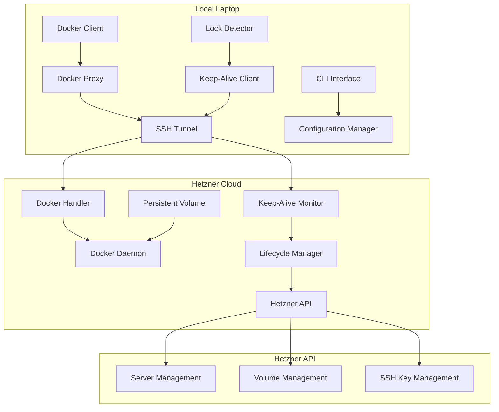
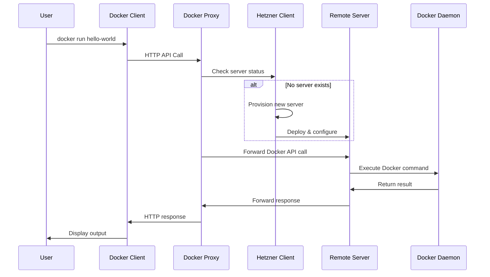

# Design Document

## Overview

DockBridge is a sophisticated client-server system built in Go that enables seamless Docker development workflows by transparently proxying Docker commands from a local laptop to remote Hetzner Cloud servers. The system intelligently manages server lifecycle based on user activity, implements robust keep-alive mechanisms, and provides persistent storage across server recreations.

The architecture follows a monorepo structure with two main components:
- **Client**: Runs locally, handles Docker socket proxying, screen lock detection, and keep-alive messaging
- **Server**: Runs on Hetzner Cloud instances, processes Docker commands and manages self-destruction

## Architecture

### High-Level System Architecture



### Component Interaction Flow



## Components and Interfaces

### Client Components

#### 1. Docker Proxy (`internal/client/docker/`)
**Interface:**
```go
type DockerProxy interface {
    Start(ctx context.Context, config *Config) error
    Stop() error
    ForwardRequest(req *http.Request) (*http.Response, error)
}
```

**Responsibilities:**
- Intercepts Docker API calls on local socket
- Establishes SSH tunnels to remote servers
- Forwards HTTP requests with proper authentication
- Maintains connection pooling for performance
- Handles request/response streaming for large operations

#### 2. Hetzner Client (`internal/client/hetzner/`)
**Interface:**
```go
type HetznerClient interface {
    ProvisionServer(ctx context.Context, config *ServerConfig) (*Server, error)
    DestroyServer(ctx context.Context, serverID string) error
    CreateVolume(ctx context.Context, size int, location string) (*Volume, error)
    AttachVolume(ctx context.Context, serverID, volumeID string) error
    ManageSSHKeys(ctx context.Context) error
}
```

**Responsibilities:**
- Server provisioning with Docker CE pre-installed
- Volume creation and attachment management
- SSH key generation, upload, and rotation
- Cloud-init script deployment for server configuration
- Resource cleanup and cost optimization

#### 3. Lock Detector (`internal/client/lockdetection/`)
**Interface:**
```go
type LockDetector interface {
    Start(ctx context.Context) (<-chan LockEvent, error)
    Stop() error
}

type LockEvent struct {
    Type      LockEventType // Locked, Unlocked
    Timestamp time.Time
}
```

**Platform-specific implementations:**
- **Linux**: D-Bus monitoring for screensaver events
- **macOS**: Core Graphics session state monitoring  
- **Windows**: Win32 API desktop switching detection

#### 4. Keep-Alive Client (`internal/client/keepalive/`)
**Interface:**
```go
type KeepAliveClient interface {
    Start(ctx context.Context, serverEndpoint string) error
    Stop() error
    SendHeartbeat() error
}
```

**Responsibilities:**
- Sends periodic heartbeat messages (30-second intervals)
- Implements exponential backoff for network failures
- Handles connection recovery and retry logic
- Coordinates with lock detector for graceful shutdowns

### Server Components

#### 1. Docker Handler (`internal/server/docker/`)
**Interface:**
```go
type DockerHandler interface {
    HandleRequest(w http.ResponseWriter, r *http.Request)
    Start(ctx context.Context) error
    Stop() error
}
```

**Responsibilities:**
- Receives proxied Docker API calls via HTTP
- Maintains full Docker API compatibility
- Forwards requests to local Docker daemon
- Streams responses back to client
- Handles concurrent operations efficiently

#### 2. Keep-Alive Monitor (`internal/server/keepalive/`)
**Interface:**
```go
type KeepAliveMonitor interface {
    Start(ctx context.Context) error
    Stop() error
    RecordHeartbeat(clientID string) error
    GetTimeoutClients() []string
}
```

**Responsibilities:**
- Tracks client heartbeat messages
- Implements configurable timeout detection (5-minute default)
- Triggers lifecycle manager on client timeouts
- Maintains client connection state

#### 3. Lifecycle Manager (`internal/server/lifecycle/`)
**Interface:**
```go
type LifecycleManager interface {
    Start(ctx context.Context) error
    InitiateShutdown(reason ShutdownReason) error
    CancelShutdown() error
}
```

**Responsibilities:**
- Handles graceful server shutdown sequences
- Detaches volumes before termination
- Self-destructs via Hetzner API calls
- Implements shutdown cancellation for quick reconnects

## Data Models

### Configuration Models
```go
type ClientConfig struct {
    Hetzner    HetznerConfig    `yaml:"hetzner"`
    Docker     DockerConfig     `yaml:"docker"`
    KeepAlive  KeepAliveConfig  `yaml:"keepalive"`
    SSH        SSHConfig        `yaml:"ssh"`
    Logging    LoggingConfig    `yaml:"logging"`
}

type HetznerConfig struct {
    APIToken   string `yaml:"api_token" env:"HETZNER_API_TOKEN"`
    ServerType string `yaml:"server_type" default:"cpx21"`
    Location   string `yaml:"location" default:"fsn1"`
    VolumeSize int    `yaml:"volume_size" default:"10"`
}

type DockerConfig struct {
    SocketPath string `yaml:"socket_path" default:"/var/run/docker.sock"`
    ProxyPort  int    `yaml:"proxy_port" default:"2376"`
}
```

### Server State Models
```go
type Server struct {
    ID          string            `json:"id"`
    Name        string            `json:"name"`
    Status      ServerStatus      `json:"status"`
    IPAddress   string            `json:"ip_address"`
    VolumeID    string            `json:"volume_id"`
    CreatedAt   time.Time         `json:"created_at"`
    Metadata    map[string]string `json:"metadata"`
}

type ServerStatus string
const (
    StatusProvisioning ServerStatus = "provisioning"
    StatusRunning      ServerStatus = "running"
    StatusShuttingDown ServerStatus = "shutting_down"
    StatusTerminated   ServerStatus = "terminated"
)
```

### Keep-Alive Models
```go
type HeartbeatMessage struct {
    ClientID    string            `json:"client_id"`
    Timestamp   time.Time         `json:"timestamp"`
    Status      ClientStatus      `json:"status"`
    Metadata    map[string]string `json:"metadata"`
}

type ClientStatus string
const (
    StatusActive   ClientStatus = "active"
    StatusLocked   ClientStatus = "locked"
    StatusOffline  ClientStatus = "offline"
)
```

## Error Handling

### Error Categories
```go
type ErrorCategory string
const (
    ErrCategoryNetwork     ErrorCategory = "network"
    ErrCategoryHetzner     ErrorCategory = "hetzner"
    ErrCategoryDocker      ErrorCategory = "docker"
    ErrCategorySSH         ErrorCategory = "ssh"
    ErrCategoryConfig      ErrorCategory = "config"
    ErrCategoryLockDetect  ErrorCategory = "lock_detection"
)

type DockBridgeError struct {
    Category    ErrorCategory `json:"category"`
    Code        string        `json:"code"`
    Message     string        `json:"message"`
    Cause       error         `json:"cause,omitempty"`
    Retryable   bool          `json:"retryable"`
    Timestamp   time.Time     `json:"timestamp"`
}
```

### Retry Strategies
- **Network failures**: Exponential backoff with jitter (1s, 2s, 4s, 8s, max 60s)
- **Hetzner API rate limits**: Respect rate limit headers with backoff
- **Docker command failures**: Immediate retry up to 3 attempts
- **SSH connection failures**: Progressive timeout increase (5s, 15s, 30s)

### Graceful Degradation
- **Offline mode**: Cache last known server state, queue operations
- **Partial failures**: Continue operation with reduced functionality
- **Resource constraints**: Implement circuit breakers for external services

## Testing Strategy

### Unit Testing Framework
Using `github.com/stretchr/testify` with comprehensive test suites:

```go
type DockerProxyTestSuite struct {
    suite.Suite
    mockHetznerClient *mocks.HetznerClient
    mockSSHClient     *mocks.SSHClient
    proxy            *DockerProxy
    testServer       *httptest.Server
}

func (suite *DockerProxyTestSuite) TestForwardDockerCommand() {
    // Arrange
    expectedResponse := &http.Response{StatusCode: 200}
    suite.mockSSHClient.On("ForwardHTTP", mock.Anything).Return(expectedResponse, nil)
    
    // Act
    response, err := suite.proxy.ForwardRequest(testRequest)
    
    // Assert
    suite.NoError(err)
    suite.Equal(200, response.StatusCode)
    suite.mockSSHClient.AssertExpectations(suite.T())
}
```

### Integration Testing
- **Hetzner API Integration**: Test server provisioning with real API calls using test credentials
- **Docker Compatibility**: Validate all major Docker commands work correctly
- **End-to-End Workflows**: Test complete user scenarios from command to response

### Performance Testing
- **Latency Benchmarks**: Measure Docker command response times vs local execution
- **Concurrent Operations**: Test system behavior under multiple simultaneous Docker commands
- **Resource Usage**: Monitor memory and CPU usage during extended operations

### Security Testing
- **SSH Key Management**: Validate key generation, rotation, and secure storage
- **Network Security**: Test encrypted communication channels
- **API Token Handling**: Ensure secure storage and transmission of credentials

## Technology Stack

### Core Dependencies
- **Docker Integration**: `github.com/docker/docker/client` for Docker API compatibility
- **Hetzner Cloud**: `github.com/hetznercloud/hcloud-go/v2/hcloud` for cloud resource management
- **SSH Communication**: `golang.org/x/crypto/ssh` with `github.com/melbahja/goph` wrapper
- **CLI Framework**: `github.com/spf13/cobra` with `github.com/spf13/viper` for configuration
- **Lock Detection**: `github.com/IamFaizanKhalid/lock` with platform-specific implementations
- **Testing**: `github.com/stretchr/testify` for comprehensive test coverage

### Security Considerations
- **Credential Management**: Environment variables and secure file storage for API tokens
- **SSH Security**: RSA 4096-bit keys with regular rotation
- **Network Security**: TLS 1.3 for all HTTP communications
- **Access Control**: Principle of least privilege for Hetzner API permissions

### Performance Optimizations
- **Connection Pooling**: Reuse HTTP connections for Docker API calls
- **Concurrent Processing**: Goroutine-based handling of multiple Docker operations
- **Caching**: Local cache for server state and configuration
- **Compression**: Enable gzip compression for large Docker image transfers