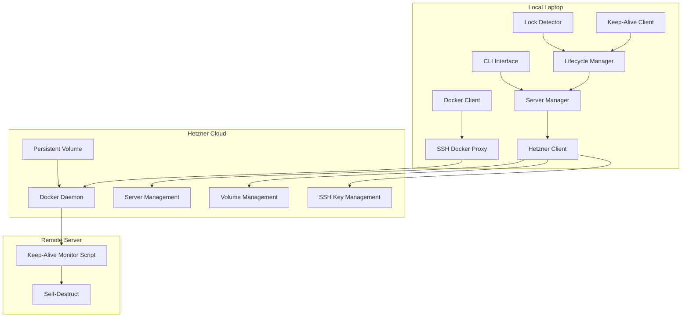
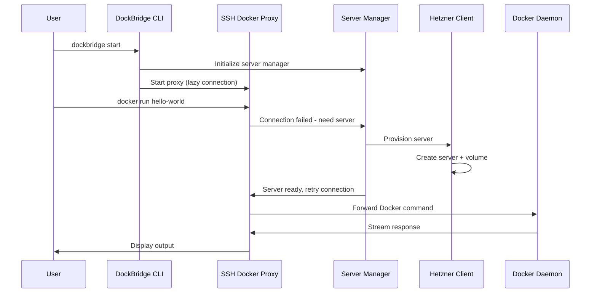

# Design Document

## Overview

DockBridge is a simplified client system built in Go that enables seamless Docker development workflows by automatically provisioning Hetzner Cloud servers on-demand and using the ssh-docker-proxy library for transparent Docker command forwarding. The system focuses on cost optimization through intelligent server lifecycle management while providing a simple, reliable user experience.

The simplified architecture has one main component:
- **Client**: Runs locally, uses ssh-docker-proxy library for Docker forwarding, manages server lifecycle and keep-alive messaging

## Architecture

### Simplified System Architecture



### Component Interaction Flow



## Components and Interfaces

### 1. Server Manager (`internal/server/`)
**Interface:**
```go
type ServerManager interface {
    EnsureServer(ctx context.Context) (*ServerInfo, error)
    DestroyServer(ctx context.Context, serverID string) error
    GetServerStatus(ctx context.Context) (*ServerStatus, error)
    ListServers(ctx context.Context) ([]*ServerInfo, error)
}
```

**Responsibilities:**
- Manages server lifecycle (provision, destroy, status)
- Integrates with Hetzner API for server operations
- Handles volume creation and attachment
- Manages SSH key deployment
- Provides server information to other components

### 2. Proxy Manager (`internal/proxy/`)
**Interface:**
```go
type ProxyManager interface {
    Start(ctx context.Context, config *ProxyConfig) error
    Stop() error
    IsRunning() bool
    GetStatus() *ProxyStatus
}
```

**Responsibilities:**
- Wraps ssh-docker-proxy library
- Handles lazy connection establishment
- Triggers server provisioning when connections fail
- Manages proxy lifecycle and configuration
- Provides connection status information

### 3. Lifecycle Manager (`internal/lifecycle/`)
**Interface:**
```go
type LifecycleManager interface {
    Start(ctx context.Context) error
    Stop() error
    RegisterLockHandler(handler LockHandler)
    RegisterIdleHandler(handler IdleHandler)
}
```

**Responsibilities:**
- Monitors laptop lock/unlock events
- Tracks Docker command activity
- Manages server shutdown timers
- Coordinates with server manager for cleanup
- Handles keep-alive client operations

### 4. Lock Detector (`internal/lockdetection/`)
**Interface:**
```go
type LockDetector interface {
    Start(ctx context.Context) (<-chan LockEvent, error)
    Stop() error
}

type LockEvent struct {
    Type      LockEventType // Locked, Unlocked
    Timestamp time.Time
}
```

**Platform-specific implementations:**
- **Linux**: D-Bus monitoring for screensaver events
- **macOS**: Core Graphics session state monitoring  
- **Windows**: Win32 API desktop switching detection

### 5. Keep-Alive Client (`internal/keepalive/`)
**Interface:**
```go
type KeepAliveClient interface {
    Start(ctx context.Context, serverEndpoint string) error
    Stop() error
    SendHeartbeat() error
}
```

**Responsibilities:**
- Sends periodic heartbeat messages (30-second intervals)
- Implements exponential backoff for network failures
- Handles connection recovery and retry logic
- Coordinates with lifecycle manager for status updates

## Data Models

### Configuration Models
```go
type Config struct {
    Hetzner    HetznerConfig    `yaml:"hetzner"`
    Docker     DockerConfig     `yaml:"docker"`
    KeepAlive  KeepAliveConfig  `yaml:"keepalive"`
    SSH        SSHConfig        `yaml:"ssh"`
    Logging    LoggingConfig    `yaml:"logging"`
}

type HetznerConfig struct {
    APIToken   string `yaml:"api_token" env:"HETZNER_API_TOKEN"`
    ServerType string `yaml:"server_type" default:"cpx21"`
    Location   string `yaml:"location" default:"fsn1"`
    VolumeSize int    `yaml:"volume_size" default:"10"`
}

type DockerConfig struct {
    SocketPath string `yaml:"socket_path" default:"/tmp/dockbridge.sock"`
}
```

### Server State Models
```go
type ServerInfo struct {
    ID          string            `json:"id"`
    Name        string            `json:"name"`
    Status      ServerStatus      `json:"status"`
    IPAddress   string            `json:"ip_address"`
    VolumeID    string            `json:"volume_id"`
    CreatedAt   time.Time         `json:"created_at"`
    Metadata    map[string]string `json:"metadata"`
}

type ServerStatus string
const (
    StatusProvisioning ServerStatus = "provisioning"
    StatusRunning      ServerStatus = "running"
    StatusShuttingDown ServerStatus = "shutting_down"
    StatusTerminated   ServerStatus = "terminated"
)
```

### Proxy State Models
```go
type ProxyStatus struct {
    Running       bool      `json:"running"`
    LocalSocket   string    `json:"local_socket"`
    RemoteServer  string    `json:"remote_server"`
    Connected     bool      `json:"connected"`
    LastActivity  time.Time `json:"last_activity"`
    BytesTransferred int64  `json:"bytes_transferred"`
}
```

## Error Handling

### Error Categories
```go
type ErrorCategory string
const (
    ErrCategoryNetwork     ErrorCategory = "network"
    ErrCategoryHetzner     ErrorCategory = "hetzner"
    ErrCategoryProxy       ErrorCategory = "proxy"
    ErrCategorySSH         ErrorCategory = "ssh"
    ErrCategoryConfig      ErrorCategory = "config"
    ErrCategoryLockDetect  ErrorCategory = "lock_detection"
)

type DockBridgeError struct {
    Category    ErrorCategory `json:"category"`
    Code        string        `json:"code"`
    Message     string        `json:"message"`
    Cause       error         `json:"cause,omitempty"`
    Retryable   bool          `json:"retryable"`
    Timestamp   time.Time     `json:"timestamp"`
}
```

### Retry Strategies
- **Network failures**: Exponential backoff with jitter (1s, 2s, 4s, 8s, max 60s)
- **Hetzner API rate limits**: Respect rate limit headers with backoff
- **Proxy connection failures**: Trigger server provisioning, then retry
- **SSH connection failures**: Progressive timeout increase (5s, 15s, 30s)

### Graceful Degradation
- **Offline mode**: Cache last known server state, queue operations
- **Partial failures**: Continue operation with reduced functionality
- **Resource constraints**: Implement circuit breakers for external services

## Implementation Strategy

### Phase 1: Core Infrastructure
1. **Project Structure**: Clean up existing complex implementation
2. **Configuration**: Simplify configuration management
3. **Server Manager**: Create simple server lifecycle management
4. **Proxy Integration**: Integrate ssh-docker-proxy library

### Phase 2: Lifecycle Management
1. **Lock Detection**: Implement cross-platform lock detection
2. **Keep-Alive**: Create simple keep-alive mechanism
3. **Lifecycle Coordination**: Connect lock detection with server management

### Phase 3: User Experience
1. **CLI Interface**: Simple start/stop/status commands
2. **Error Handling**: User-friendly error messages
3. **Logging**: Structured logging with appropriate levels
4. **Documentation**: Usage guides and troubleshooting

## Key Architectural Decisions

### 1. Use ssh-docker-proxy Library
**Decision**: Integrate ssh-docker-proxy as a library instead of building custom Docker forwarding
**Rationale**: 
- Proven, working solution for Docker command forwarding
- Eliminates complex HTTP proxy implementation
- Focuses DockBridge on its unique value: server lifecycle management

### 2. Lazy Server Provisioning
**Decision**: Only provision servers when Docker commands are actually executed
**Rationale**:
- Minimizes costs by avoiding idle servers
- Provides better user experience (fast startup)
- Aligns with on-demand usage patterns

### 3. Simple Keep-Alive Mechanism
**Decision**: Use simple file-based heartbeat instead of complex HTTP endpoints
**Rationale**:
- Reduces server-side complexity
- More reliable than HTTP-based solutions
- Easier to debug and maintain

### 4. Client-Side Server Management
**Decision**: Manage all server lifecycle operations from the client
**Rationale**:
- Eliminates need for complex server-side code
- Provides better control and visibility
- Simplifies debugging and troubleshooting

## Technology Stack

### Core Dependencies
- **Docker Forwarding**: ssh-docker-proxy library (local dependency)
- **Hetzner Cloud**: `github.com/hetznercloud/hcloud-go/v2/hcloud` for cloud resource management
- **CLI Framework**: `github.com/spf13/cobra` with `github.com/spf13/viper` for configuration
- **Lock Detection**: Platform-specific implementations using system APIs
- **Testing**: `github.com/stretchr/testify` for comprehensive test coverage

### Security Considerations
- **Credential Management**: Environment variables and secure file storage for API tokens
- **SSH Security**: RSA 4096-bit keys with regular rotation
- **Network Security**: All Docker traffic encrypted via SSH tunnels
- **Access Control**: Principle of least privilege for Hetzner API permissions

### Performance Optimizations
- **Lazy Loading**: Only provision resources when needed
- **Connection Reuse**: Maintain persistent SSH connections
- **Concurrent Processing**: Goroutine-based handling of multiple operations
- **Efficient Transfers**: Leverage ssh-docker-proxy's optimized byte copying