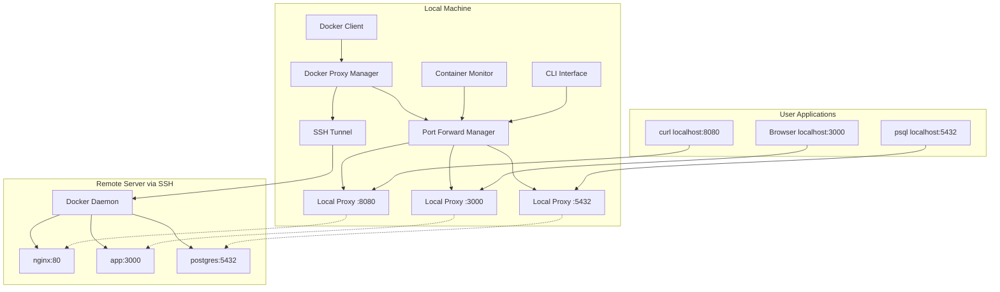
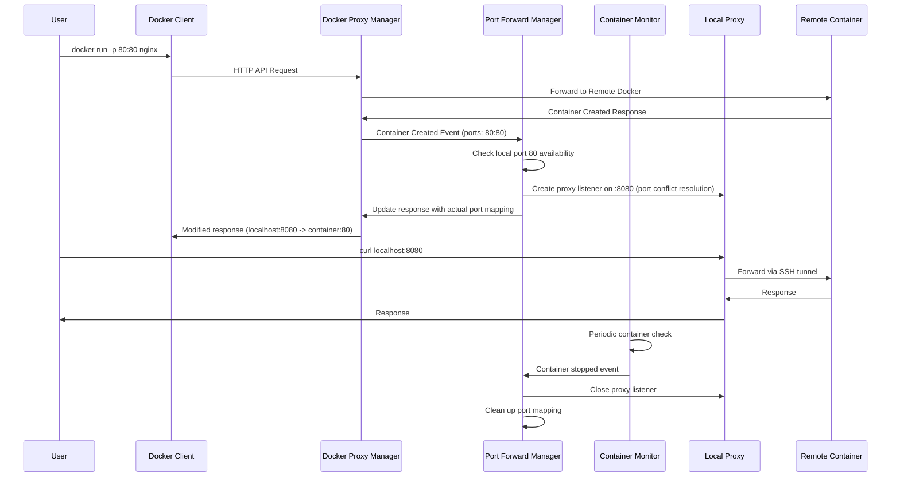

# Design Document

## Overview

Dynamic Port Forwarding extends DockBridge to automatically detect when Docker containers expose ports and creates local TCP proxy listeners that forward traffic to remote container ports via the existing SSH connection. This provides a seamless development experience where remote containerized services are accessible via localhost URLs, making `curl localhost:80` work against remote nginx containers.

The design integrates with DockBridge's existing architecture by intercepting Docker API responses, monitoring container lifecycle, and managing local TCP proxy servers that route traffic through the established SSH tunnel.

## Architecture

### High-Level Architecture



### Component Integration Flow



## Components and Interfaces

### 1. Port Forward Manager (`internal/client/portforward/`)

**Interface:**
```go
type PortForwardManager interface {
    Start(ctx context.Context) error
    Stop() error
    
    // Container lifecycle events
    OnContainerCreated(container *ContainerInfo) error
    OnContainerStopped(containerID string) error
    OnContainerRemoved(containerID string) error
    
    // Manual port management
    AddPortForward(containerID string, localPort, remotePort int) error
    RemovePortForward(containerID string, localPort int) error
    
    // Status and information
    ListPortForwards() ([]*PortForward, error)
    GetPortForward(containerID string, remotePort int) (*PortForward, error)
    
    // Configuration
    SetConfig(config *PortForwardConfig) error
}

type PortForward struct {
    ID          string    `json:"id"`
    ContainerID string    `json:"container_id"`
    ContainerName string  `json:"container_name"`
    LocalPort   int       `json:"local_port"`
    RemotePort  int       `json:"remote_port"`
    Status      ForwardStatus `json:"status"`
    CreatedAt   time.Time `json:"created_at"`
    LastUsed    time.Time `json:"last_used"`
    BytesTransferred int64 `json:"bytes_transferred"`
}

type ForwardStatus string
const (
    ForwardStatusActive   ForwardStatus = "active"
    ForwardStatusInactive ForwardStatus = "inactive"
    ForwardStatusError    ForwardStatus = "error"
)
```

**Responsibilities:**
- Manages lifecycle of local TCP proxy listeners
- Handles port conflict resolution and assignment
- Integrates with container monitoring for automatic cleanup
- Provides manual port forward management via CLI
- Tracks usage statistics and connection metrics

### 2. Container Monitor (`internal/client/monitor/`)

**Interface:**
```go
type ContainerMonitor interface {
    Start(ctx context.Context) error
    Stop() error
    
    // Event registration
    RegisterContainerEventHandler(handler ContainerEventHandler) error
    
    // Container queries
    ListRunningContainers(ctx context.Context) ([]*ContainerInfo, error)
    GetContainer(ctx context.Context, containerID string) (*ContainerInfo, error)
    
    // Monitoring configuration
    SetPollingInterval(interval time.Duration) error
}

type ContainerEventHandler interface {
    OnContainerCreated(container *ContainerInfo) error
    OnContainerStopped(containerID string) error
    OnContainerRemoved(containerID string) error
}

type ContainerInfo struct {
    ID       string            `json:"id"`
    Name     string            `json:"name"`
    Image    string            `json:"image"`
    Status   string            `json:"status"`
    Ports    []PortMapping     `json:"ports"`
    Labels   map[string]string `json:"labels"`
    Created  time.Time         `json:"created"`
}

type PortMapping struct {
    ContainerPort int    `json:"container_port"`
    HostPort      int    `json:"host_port"`
    Protocol      string `json:"protocol"`
    HostIP        string `json:"host_ip"`
}
```

**Responsibilities:**
- Monitors Docker daemon for container lifecycle events
- Extracts port mapping information from container configurations
- Provides efficient polling mechanism with configurable intervals
- Notifies port forward manager of container changes
- Handles Docker API integration for container inspection

### 3. Local Proxy Server (`internal/client/proxy/`)

**Interface:**
```go
type LocalProxyServer interface {
    Start(ctx context.Context, localPort int, remoteAddr string) error
    Stop() error
    GetStats() *ProxyStats
    IsRunning() bool
}

type ProxyStats struct {
    LocalPort        int       `json:"local_port"`
    RemoteAddr       string    `json:"remote_addr"`
    ActiveConnections int      `json:"active_connections"`
    TotalConnections int64     `json:"total_connections"`
    BytesTransferred int64     `json:"bytes_transferred"`
    LastActivity     time.Time `json:"last_activity"`
    Uptime          time.Duration `json:"uptime"`
}
```

**Responsibilities:**
- Creates TCP listeners on local ports
- Proxies connections to remote containers via SSH tunnel
- Maintains connection statistics and metrics
- Handles connection lifecycle and cleanup
- Provides efficient bidirectional data transfer

### 4. Docker API Interceptor (`internal/client/docker/`)

**Enhancement to existing DockerClientManager:**
```go
// Enhanced interface for Docker client manager
type DockerClientManager interface {
    // Existing methods
    GetClient(ctx context.Context) (*client.Client, error)
    EnsureConnection(ctx context.Context) error
    GetTunnel() ssh.TunnelInterface
    Close() error
    
    // New port forwarding integration
    RegisterContainerEventHandler(handler ContainerEventHandler) error
    InterceptDockerResponse(response []byte) ([]byte, error)
}
```

**Responsibilities:**
- Intercepts Docker API responses to detect container creation
- Extracts port mapping information from Docker responses
- Modifies responses to reflect actual local port assignments
- Integrates with existing SSH tunnel management
- Provides Docker-compatible error responses for port conflicts

### 5. Port Conflict Resolver (`internal/client/portforward/resolver/`)

**Interface:**
```go
type PortConflictResolver interface {
    ResolvePortConflict(requestedPort int, strategy ConflictStrategy) (int, error)
    IsPortAvailable(port int) bool
    GetNextAvailablePort(startPort int) (int, error)
}

type ConflictStrategy string
const (
    ConflictStrategyIncrement ConflictStrategy = "increment"  // Find next available port
    ConflictStrategyFail      ConflictStrategy = "fail"       // Return Docker error
)
```

**Responsibilities:**
- Detects local port availability using system calls
- Implements increment and fail strategies for port conflicts
- Provides Docker-compatible error messages for port conflicts
- Handles simple port availability checking

## Data Models

### Configuration Models

```go
// Simplified configuration - focus on happy path
type PortForwardConfig struct {
    Enabled          bool              `yaml:"enabled" default:"true"`
    ConflictStrategy ConflictStrategy  `yaml:"conflict_strategy" default:"increment"`
    MonitorInterval  time.Duration     `yaml:"monitor_interval" default:"30s"`
}

// Integration with existing ClientConfig
type ClientConfig struct {
    // Existing fields...
    Hetzner      HetznerConfig      `yaml:"hetzner" mapstructure:"hetzner"`
    Docker       DockerConfig       `yaml:"docker" mapstructure:"docker"`
    Activity     ActivityConfig     `yaml:"activity" mapstructure:"activity"`
    KeepAlive    KeepAliveConfig    `yaml:"keepalive" mapstructure:"keepalive"`
    SSH          SSHConfig          `yaml:"ssh" mapstructure:"ssh"`
    Logging      LoggingConfig      `yaml:"logging" mapstructure:"logging"`
    
    // New port forwarding configuration (simplified)
    PortForward  PortForwardConfig  `yaml:"port_forward" mapstructure:"port_forward"`
}
```

### State Management Models

```go
type PortForwardState struct {
    Forwards    map[string]*PortForward `json:"forwards"`
    Containers  map[string]*ContainerInfo `json:"containers"`
    PortMap     map[int]string          `json:"port_map"` // localPort -> forwardID
    LastUpdate  time.Time               `json:"last_update"`
    Statistics  *ForwardStatistics      `json:"statistics"`
}

type ForwardStatistics struct {
    TotalForwards     int64         `json:"total_forwards"`
    ActiveForwards    int           `json:"active_forwards"`
    TotalConnections  int64         `json:"total_connections"`
    BytesTransferred  int64         `json:"bytes_transferred"`
    AverageLatency    time.Duration `json:"average_latency"`
    PortConflicts     int64         `json:"port_conflicts"`
}
```

### Error Models

```go
type PortForwardError struct {
    Type        ErrorType `json:"type"`
    Message     string    `json:"message"`
    Port        int       `json:"port,omitempty"`
    ContainerID string    `json:"container_id,omitempty"`
    Cause       error     `json:"cause,omitempty"`
}

type ErrorType string
const (
    ErrorTypePortConflict     ErrorType = "port_conflict"
    ErrorTypeContainerNotFound ErrorType = "container_not_found"
    ErrorTypeProxyFailed      ErrorType = "proxy_failed"
    ErrorTypeSSHError         ErrorType = "ssh_error"
    ErrorTypeConfigError      ErrorType = "config_error"
)

// Docker-compatible error responses
func (e *PortForwardError) ToDockerError() *DockerAPIError {
    switch e.Type {
    case ErrorTypePortConflict:
        return &DockerAPIError{
            Message: fmt.Sprintf("port is already allocated (local machine): %d", e.Port),
            Code:    "port_already_allocated",
        }
    default:
        return &DockerAPIError{
            Message: e.Message,
            Code:    "internal_error",
        }
    }
}
```

## Error Handling

### Port Conflict Resolution

The system handles port conflicts by implementing two simple strategies:

1. **Increment Strategy** (default): Try same port first, then increment (80 -> 8080 -> 8081...)
2. **Fail Strategy**: Return Docker-compatible error immediately if requested port unavailable

### Docker API Compatibility

Port forwarding errors are translated to Docker-compatible responses:

```go
// Example Docker-compatible error response
{
    "message": "driver failed programming external connectivity on endpoint nginx_1: Error starting userland proxy: listen tcp 0.0.0.0:80: bind: address already in use (local machine)"
}
```

### Graceful Degradation

- **SSH Connection Loss**: Mark forwards as inactive, attempt reconnection
- **Container Monitoring Failure**: Fall back to manual port management
- **Local Port Unavailable**: Automatic port reassignment with user notification
- **Remote Container Unreachable**: Maintain forward configuration for reconnection

## Testing Strategy

### Unit Testing

1. **Port Conflict Resolution**: Test all conflict strategies with various scenarios
2. **Container Monitoring**: Mock Docker API responses for lifecycle events
3. **Proxy Server**: Test bidirectional data transfer and connection handling
4. **Configuration Management**: Validate all configuration options and defaults

### Integration Testing

1. **End-to-End Port Forwarding**: Test complete flow from container creation to local access
2. **Docker Compose Integration**: Verify multi-container service forwarding
3. **SSH Tunnel Integration**: Test with existing DockBridge SSH infrastructure
4. **Error Scenarios**: Test port conflicts, connection failures, and recovery

### Performance Testing

1. **Concurrent Connections**: Test multiple simultaneous connections per forward
2. **High Throughput**: Test large file transfers through port forwards
3. **Latency Measurement**: Measure overhead compared to direct SSH port forwarding
4. **Resource Usage**: Monitor CPU and memory usage under load

### Test Infrastructure

```go
// Mock implementations for testing
type MockDockerClient struct {
    containers map[string]*ContainerInfo
    responses  map[string][]byte
}

type MockSSHTunnel struct {
    connections map[string]net.Conn
    latency     time.Duration
}

// Integration test helpers
func SetupTestEnvironment() (*TestEnvironment, func()) {
    // Setup mock Docker daemon, SSH server, and test containers
}

func TestPortForwardingFlow(t *testing.T) {
    // Test complete port forwarding lifecycle
}
```

## Implementation Strategy

### Phase 1: Core Infrastructure (Happy Path Focus)

1. **Port Forward Manager**: Implement basic port forward lifecycle management
2. **Local Proxy Server**: Create simple TCP proxy with SSH tunnel integration
3. **Port Conflict Resolver**: Implement increment and fail strategies only
4. **Container Monitor**: Basic Docker API monitoring for container events

### Phase 2: Docker Integration

1. **API Interceptor**: Enhance DockerClientManager with response interception
2. **Error Handling**: Implement Docker-compatible error responses for port conflicts
3. **State Management**: Simple in-memory state tracking for forwards
4. **Default Port Mapping**: Map local ports to same as remote ports (happy path)

### Phase 3: User Experience

1. **CLI Status**: Add basic port forwarding status to existing CLI
2. **Logging Integration**: Add port forwarding logs to existing logging system
3. **Basic Manual Controls**: Simple start/stop port forwarding commands
4. **Documentation**: Essential usage documentation

## Key Architectural Decisions

### 1. Proxy-Based Approach vs SSH Port Forwarding

**Decision**: Use local TCP proxy servers that route through existing SSH tunnel
**Rationale**:
- Better integration with existing DockBridge architecture
- Full control over connection lifecycle and error handling
- Easier cleanup when containers stop
- Better logging and metrics collection
- Unified error handling with existing components

### 2. Container Monitoring Strategy

**Decision**: Use Docker API polling with event-driven updates
**Rationale**:
- Reliable detection of container lifecycle changes
- Works with existing Docker client infrastructure
- Configurable polling intervals for efficiency
- Handles Docker daemon restarts gracefully

### 3. Port Conflict Resolution

**Decision**: Implement increment and fail strategies, default to increment
**Rationale**:
- Increment strategy provides best developer experience (try same port first, then increment)
- Fail strategy maintains Docker compatibility for strict environments
- Simple implementation focuses on core functionality
- Easy to extend with additional strategies later

### 4. State Management

**Decision**: Simple in-memory state management
**Rationale**:
- Fast access for real-time operations
- Simplified implementation focusing on happy path
- Aligns with existing DockBridge stateless design
- Reduces complexity for initial implementation

## Security Considerations

### Network Security
- All forwarded traffic encrypted via SSH tunnel
- Local proxy servers bind to localhost only by default
- Optional configuration for specific interface binding
- Port access logging for security auditing

### Access Control
- Integration with existing SSH key management
- Port forwarding respects Docker container security contexts
- Optional port range restrictions for security policies
- Audit logging for all port forward operations

### Resource Protection
- Connection limits per port forward to prevent DoS
- Automatic cleanup of stale connections
- Memory usage monitoring and limits
- CPU usage throttling for proxy operations

## Performance Optimizations

### Connection Management
- Connection pooling for frequently accessed ports
- Keep-alive mechanisms for persistent connections
- Efficient buffer management for data transfer
- Concurrent connection handling with goroutines

### Monitoring Efficiency
- Intelligent polling intervals based on activity
- Event-driven updates when possible
- Batch processing of container changes
- Caching of container information

### Resource Usage
- Lazy initialization of proxy servers
- Automatic cleanup of unused forwards
- Memory-efficient data structures
- Optimized network buffer sizes